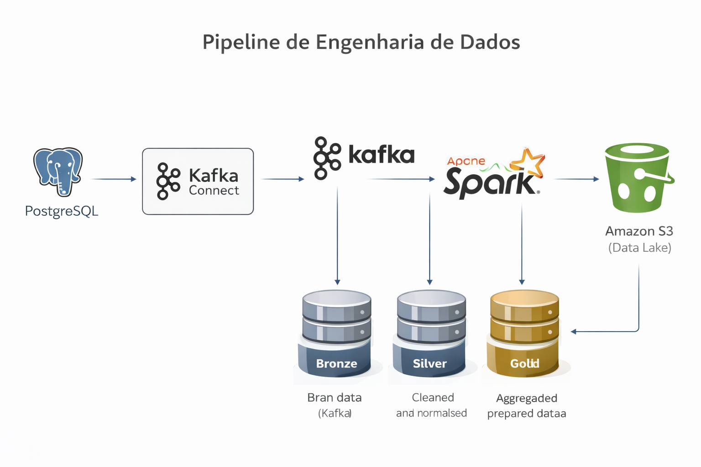
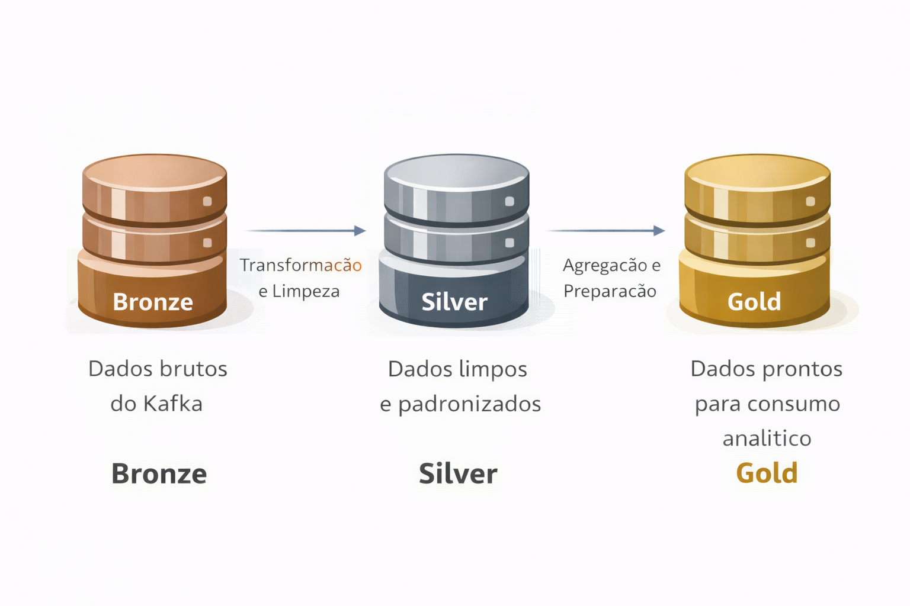
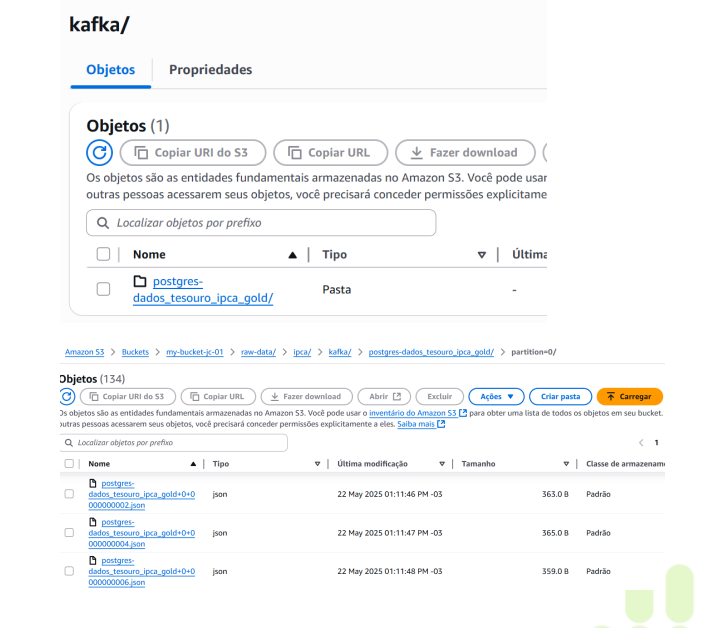

# Pipeline de Engenharia de Dados com Kafka, Spark e AWS

## 📌 Visão Geral
Este projeto foi desenvolvido como um desafio prático de Engenharia de Dados, com o objetivo de construir uma **pipeline de dados ponta a ponta**, integrando ingestão, processamento e armazenamento em ambiente distribuído.

A solução utiliza **Apache Kafka** para streaming de dados, **Apache Spark** para processamento e transformação, e **Amazon S3** como Data Lake, seguindo a arquitetura **Bronze, Silver e Gold**.

O projeto foi executado em ambiente containerizado com **Docker**, simulando um cenário real de produção.

---

## 🎯 Objetivos do Projeto
- Implementar ingestão de dados em tempo real
- Processar dados utilizando Spark
- Organizar dados em camadas Bronze, Silver e Gold
- Armazenar dados em Data Lake (Amazon S3)
- Integrar múltiplas tecnologias em uma arquitetura escalável
- Demonstrar domínio de ferramentas de Engenharia de Dados

---

## 🛠️ Tecnologias Utilizadas
- **Apache Kafka**
- **Kafka Connect (Source e Sink)**
- **Apache Spark**
- **PostgreSQL**
- **Amazon S3**
- **Docker e Docker Compose**
- **Python**
- **Arquitetura Bronze / Silver / Gold**

---

## 🧱 Arquitetura da Solução
A arquitetura foi projetada para suportar ingestão contínua e processamento distribuído de dados.

Fluxo resumido:
1. Dados transacionais armazenados em PostgreSQL
2. Kafka Connect realiza a ingestão dos dados
3. Apache Kafka atua como camada de streaming
4. Apache Spark consome os dados do Kafka
5. Dados são transformados e organizados nas camadas Bronze, Silver e Gold
6. Armazenamento final no Amazon S3 (Data Lake)

---

## 🗃️ Arquitetura Bronze, Silver e Gold
A organização dos dados segue o padrão de Data Lake moderno:

- **Bronze:** dados brutos ingeridos do Kafka
- **Silver:** dados tratados, limpos e padronizados
- **Gold:** dados prontos para consumo analítico

---

## 🔄 Streaming de Dados com Apache Kafka
O Apache Kafka é utilizado como plataforma central de streaming, permitindo ingestão contínua e desacoplamento entre produtores e consumidores.

Principais pontos:
- Uso de tópicos para organização dos dados
- Kafka Connect para integração com PostgreSQL e S3
- Alta escalabilidade e tolerância a falhas

---

## ⚙️ Processamento de Dados com Apache Spark
O Apache Spark é responsável pelo processamento e transformação dos dados, utilizando:
- DataFrames
- Spark SQL
- Processamento distribuído

As transformações aplicadas garantem qualidade, padronização e preparação dos dados para análises posteriores.

---

## ☁️ Armazenamento em Data Lake (AWS S3)
O Amazon S3 é utilizado como Data Lake, oferecendo:
- Escalabilidade
- Alta durabilidade
- Baixo custo de armazenamento
- Integração com ferramentas analíticas

---

## 📂 Documentação do Projeto
- [Contexto do Desafio](docs/01-contexto-do-desafio.md)
- [Arquitetura da Solução](docs/02-arquitetura-da-solucao.md)
- [Pipeline Bronze, Silver e Gold](docs/03-pipeline-bronze-silver-gold.md)
- [Streaming com Kafka](docs/04-streaming-com-kafka.md)
- [Processamento com Spark](docs/05-processamento-com-spark.md)
- [Implantação e Execução](docs/06-implantacao-e-execucao.md)

---

## ✅ Considerações Finais
Este projeto demonstra a construção de uma pipeline de Engenharia de Dados moderna, integrando tecnologias amplamente utilizadas no mercado e aplicando boas práticas de arquitetura, escalabilidade e processamento distribuído.

O repositório tem como objetivo servir como **portfólio técnico**, evidenciando o uso prático das ferramentas e a integração entre elas.
